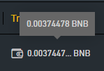

# RemoveAnnoyingBinanceTooltips 
 Fixes a usability problem on binance's pro page whereby tooltips obscure buttons unless you move the mouse in from another direction.

Please see the header in RemoveAnnoyingBinanceTooltips.js for instructions.

By doing so you accept that there is absolutely no warranty, and you take
responsibility for any issues arising from its use.

